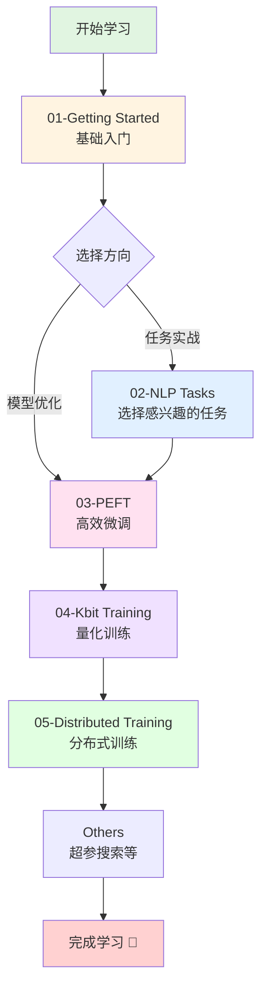

# 手把手带你实战 Transformers 🚀

<div align="center">


[](https://www.python.org/downloads/)
[](https://pytorch.org/)
[](https://github.com/huggingface/transformers)
[](LICENSE)

**系统化学习 Hugging Face Transformers 的完整实战教程**

[快速开始](#-快速开始) • [课程大纲](#-课程大纲) • [学习路线](#-学习路线) • [环境配置](#️-环境配置)

</div>

---

## 📖 目录

- [项目简介](#-项目简介)
- [适合人群](#-适合人群)
- [核心内容](#-核心内容)
- [项目特色](#-项目特色)
- [课程大纲](#-课程大纲)
- [学习路线](#-学习路线)
- [环境配置](#️-环境配置)
- [快速开始](#-快速开始)
- [项目统计](#-项目统计)
- [常见问题](#-常见问题)
- [贡献指南](#-贡献指南)
- [致谢](#-致谢)

---

## 🎯 项目简介

本仓库是 **手把手带你实战 Transformers** 课程的配套代码库，为希望系统学习 [Hugging Face Transformers](https://github.com/huggingface/transformers) 的开发者与研究者提供完整的学习路径。

从**环境搭建**、**基础 API** 使用，到 **NLP 多任务实战**、**参数高效微调（PEFT）**、**低精度/量化训练**，再到**分布式训练**，涵盖从入门到精通的全部内容。

---

## 👥 适合人群

| 人群类型 | 基础要求 | 学习目标 |
|---------|---------|---------|
| 🌱 **初学者** | Python + 基础深度学习 | 从零掌握 Transformers 用法 |
| 📈 **进阶者** | 会用 Pipeline | 深入理解 Tokenizer、Model、Datasets、Trainer |
| 💼 **实战者** | 有项目需求 | 完成文本分类、NER、问答、摘要等任务落地 |
| 🤖 **大模型开发者** | 关注前沿技术 | 掌握 LoRA/QLoRA、分布式训练、模型优化 |

---

## 📚 核心内容

### 🔰 基础篇
掌握 **Pipeline**、**Tokenizer**、**Model**、**Datasets**、**Evaluate**、**Trainer** 的核心用法，通过完整的文本分类项目串联知识点。

### 🎯 实战篇
涵盖 8+ 主流 NLP 任务：
- 命名实体识别（NER）
- 机器阅读理解（MRC）
- 多项选择（Multiple Choice）
- 文本相似度（Sentence Similarity）
- 检索式/生成式对话（Chatbot）
- 语言模型（LM）
- 文本摘要（Summarization）

### ⚡ 高效微调篇
深入 **PEFT**（Parameter-Efficient Fine-Tuning）技术：
- BitFit、Prompt Tuning、P-Tuning、Prefix Tuning
- **LoRA**（Low-Rank Adaptation）
- IA3、多适配器管理

### 🔬 低精度篇
掌握模型量化与加速：
- FP16 半精度训练
- 8-bit 量化训练
- **4-bit QLoRA** 训练
- 支持 LLaMA2、ChatGLM3、InternLM 等主流大模型

### 🚄 分布式篇
学习多卡训练与加速：
- Data Parallel（DP）
- Distributed Data Parallel（DDP）
- **Accelerate** 框架
- **Accelerate + DeepSpeed**（ZeRO-2/3）

---

## ✨ 项目特色

- ✅ **系统化组织**：33 个章节按难度递进，目录与课程一一对应
- ✅ **实战导向**：46 个 Jupyter Notebooks + 24 个 Python 脚本
- ✅ **开箱即用**：配备完整数据集和评估脚本，可直接复现
- ✅ **前沿技术**：涵盖 LoRA、QLoRA、DeepSpeed 等最新方法
- ✅ **中文友好**：全中文文档和注释，降低学习门槛
- ✅ **主流生态**：紧跟 Hugging Face 社区最佳实践

---

## 📋 课程大纲

### 📁 01-Getting Started（基础入门）

| 章节 | 内容 | 核心知识点 |
|-----|------|-----------|
| 01 | Introduction | 环境配置、快速入门 |
| 02 | Pipeline | 高层 API 使用 |
| 03 | Tokenizer | 文本预处理与编码 |
| 04 | Model | 模型加载与推理（含文本分类示例） |
| 05 | Datasets | 数据集加载与处理 |
| 06 | Evaluate | 模型评估与指标 |
| 07 | Trainer | 训练循环封装 |

### 🎯 02-NLP Tasks（实战任务）

| 章节 | 任务类型 | 应用场景 |
|-----|---------|---------|
| 08 | Transformers Solution | 解决方案总览 |
| 09 | Token Classification | 命名实体识别（NER） |
| 10 | Question Answering | 机器阅读理解（含滑动窗口） |
| 11 | Multiple Choice | 多项选择（C3 数据集） |
| 12 | Sentence Similarity | 文本相似度匹配 |
| 13 | Retrieval Chatbot | 检索式对话（FAQ） |
| 14 | Language Model | 因果/掩码语言模型 |
| 15 | Text Summarization | 文本摘要（T5/GLM） |
| 16 | Generative Chatbot | 生成式对话（Alpaca 格式） |

### ⚡ 03-PEFT（参数高效微调）

| 章节 | 方法 | 特点 |
|-----|------|------|
| 17 | BitFit | 仅微调偏置项 |
| 18 | Prompt Tuning | 软提示学习 |
| 19 | P-Tuning | 连续提示优化 |
| 20 | Prefix Tuning | 前缀调优 |
| 21 | LoRA | 低秩适配（⭐ 推荐） |
| 22 | IA3 | 激活值缩放 |
| 23 | PEFT Advanced | 多适配器管理 |

### 🔬 04-Kbit Training（量化训练）

| 章节 | 精度 | 适用场景 |
|-----|------|---------|
| 24 | LLM Download | 大模型下载与加载 |
| 25 | 16-bit Training | FP16 半精度（LLaMA2、ChatGLM3） |
| 26 | 8-bit Training | INT8 量化训练 |
| 27 | 4-bit Training | QLoRA 4-bit（含权重可视化） |

### 🚄 05-Distributed Training（分布式训练）

| 章节 | 技术 | 应用 |
|-----|------|------|
| 28 | Remote SSH | 远程训练与 DP |
| 29 | Data Parallel | 数据并行 |
| 30 | DDP | 分布式数据并行 |
| 31 | Accelerate DDP | Accelerate 封装 |
| 32 | Accelerate Advanced | 高级配置 |
| 33 | Accelerate + DeepSpeed | ZeRO-2/3 优化 |

### 🔧 Others（补充技能）

- **Optuna 超参数搜索**：自动化调参

---

## 🗺️ 学习路线



### 📝 学习建议

1. **第一阶段**（1-2 周）：完成 `01-Getting Started` 全部 7 个章节，打牢基础
2. **第二阶段**（2-3 周）：从 `02-NLP Tasks` 中选择 2-3 个感兴趣的任务深入实战
3. **第三阶段**（1-2 周）：学习 `03-PEFT`，掌握 LoRA 等高效微调方法
4. **第四阶段**（1 周）：了解 `04-Kbit Training`，学习模型量化
5. **第五阶段**（1-2 周）：学习 `05-Distributed Training`，掌握多卡训练
6. **进阶**：根据需要学习 `Others` 中的超参搜索等技能

---

## 🛠️ 环境配置

### 系统要求

- **Python**：3.8 或更高版本
- **CUDA**：11.8 或更高（GPU 训练需要）
- **内存**：建议 16GB+
- **显存**：建议 8GB+（量化训练可降低要求）

### 核心依赖

| 依赖库 | 推荐版本 | 说明 |
|--------|---------|------|
| `torch` | 2.2.1+cu118 | 深度学习框架（需匹配 CUDA 版本） |
| `transformers` | 4.42.4 | Hugging Face 核心库 |
| `peft` | 0.11.1 | 参数高效微调 |
| `datasets` | 2.20.0 | 数据集加载 |
| `accelerate` | 0.32.1 | 分布式训练加速 |
| `bitsandbytes` | 0.43.1 | 量化训练（低精度章节需要） |
| `faiss-cpu` | 1.7.4 | 向量检索（检索式对话需要） |
| `tensorboard` | 2.14.0 | 训练可视化 |

### 安装步骤

```bash
# 1. 安装核心依赖
pip install torch transformers peft datasets accelerate

# 2. 安装量化训练依赖（可选）
pip install bitsandbytes

# 3. 安装其他工具（可选）
pip install faiss-cpu tensorboard

# 4. 验证安装
python -c "import torch; import transformers; print(f'PyTorch: {torch.__version__}, Transformers: {transformers.__version__}')"
```

### 国内镜像加速（可选）

```bash
# 使用清华镜像
pip install -i https://pypi.tuna.tsinghua.edu.cn/simple torch transformers peft datasets accelerate

# 设置 Hugging Face 镜像
export HF_ENDPOINT=https://hf-mirror.com
```

---

## 🚀 快速开始

### 1️⃣ 克隆仓库

```bash
git clone https://github.com/<your-org>/learn-huggingface.git
cd learn-huggingface
```

### 2️⃣ 安装依赖

```bash
pip install torch transformers peft datasets accelerate
```

### 3️⃣ 运行第一个示例

```bash
cd "01-Getting Started/01-introduction"
jupyter notebook demo.ipynb
```

或直接运行 Python 脚本：

```bash
python demo.py
```

### 4️⃣ 尝试完整任务

**文本分类示例**：
```bash
cd "01-Getting Started/04-model"
jupyter notebook classification_demo.ipynb
```

**命名实体识别示例**：
```bash
cd "02-NLP Tasks/09-token_classification"
jupyter notebook ner_demo.ipynb
```

---

## 📊 项目统计

- 📂 **总章节数**：33 个
- 📓 **Jupyter Notebooks**：46 个
- 🐍 **Python 脚本**：24 个
- 📦 **项目大小**：约 226 MB
- 🎯 **覆盖任务**：8+ 主流 NLP 任务
- ⚡ **PEFT 方法**：6+ 种高效微调技术

---

## ❓ 常见问题

<details>
<summary><b>Q1: 需要 GPU 吗？</b></summary>

- **基础篇**（01-Getting Started）：CPU 即可运行
- **实战篇**（02-NLP Tasks）：建议使用 GPU，但小模型可用 CPU
- **PEFT/量化/分布式**：强烈建议使用 GPU，量化训练可降低显存需求
</details>

<details>
<summary><b>Q2: 如何下载模型和数据集？</b></summary>

- 大部分示例会自动从 Hugging Face Hub 下载
- 国内用户建议设置镜像：`export HF_ENDPOINT=https://hf-mirror.com`
- 也可以手动下载后放到本地路径
</details>

<details>
<summary><b>Q3: 遇到 CUDA 版本不匹配怎么办？</b></summary>

```bash
# 查看 CUDA 版本
nvidia-smi

# 安装对应版本的 PyTorch（以 CUDA 11.8 为例）
pip install torch==2.2.1+cu118 -f https://download.pytorch.org/whl/torch_stable.html
```
</details>

<details>
<summary><b>Q4: 可以只学习部分章节吗？</b></summary>

可以！建议先完成 `01-Getting Started` 打基础，然后根据需求选择感兴趣的章节学习。
</details>

---

## 🤝 贡献指南

欢迎贡献代码、修复 Bug、完善文档！

1. Fork 本仓库
2. 创建特性分支：`git checkout -b feature/your-feature`
3. 提交更改：`git commit -m 'Add some feature'`
4. 推送分支：`git push origin feature/your-feature`
5. 提交 Pull Request

---

## 🙏 致谢

本仓库配套 **手把手带你实战 Transformers** 系列课程，视频与代码持续更新中。

- 感谢 [Hugging Face](https://huggingface.co/) 提供优秀的开源生态
- 感谢所有贡献者和学习者的支持

如有问题或建议，欢迎通过 [Issue](https://github.com/<your-org>/learn-huggingface/issues) 反馈。

---

<div align="center">

**⭐ 如果这个项目对你有帮助，请给个 Star 支持一下！⭐**

Made with ❤️ by Transformers 学习者

</div>
